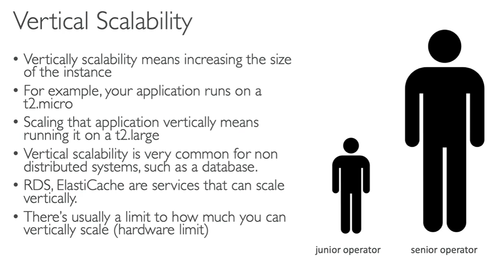
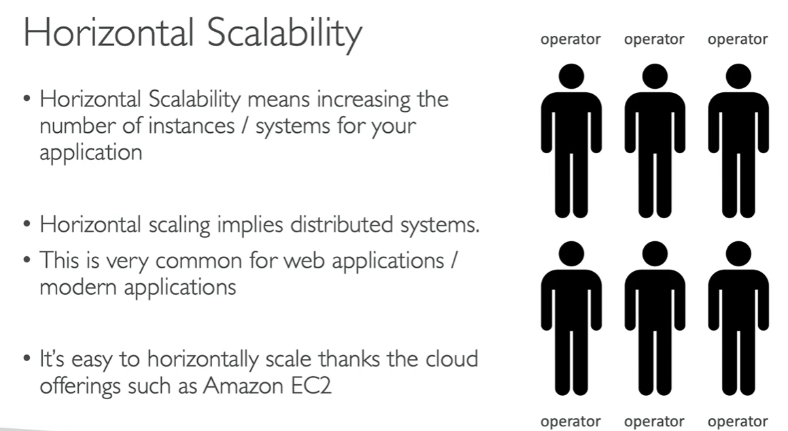
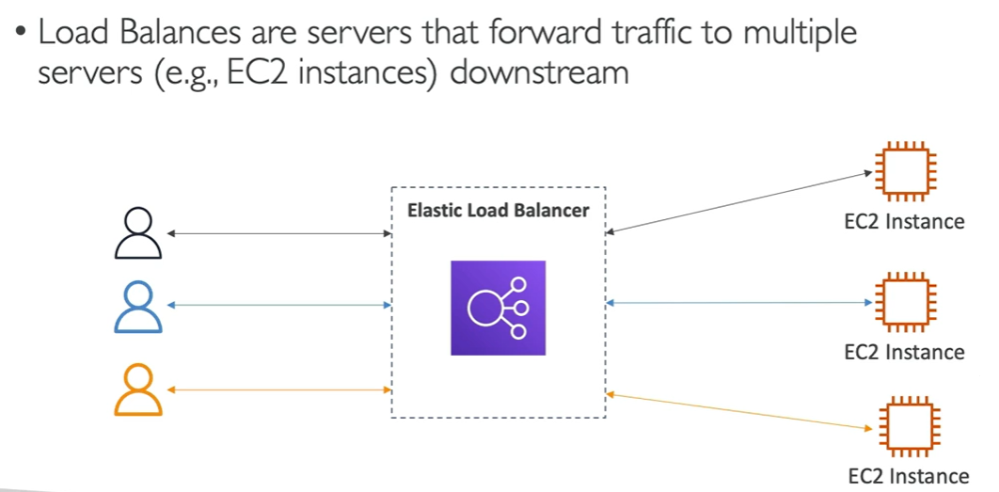

# High Availability and Scalability (ESG & ASG)

- there are two kinds of scalability
  - vertical scaling
  - horizontal scaling (elasticy)
- scalability is linked but different to high availability.

## Vertical scaling
- vertically scalabity means increase the size of the instance.
- for example, your application runs on a t2.micro.
- scaling that application vertically means running it on a t2.large.
- is more common is database systems (distributed systems)
- RDS, ElastiCache, are services that can scale vertically.

## Horizontal scaling
- increasing the number of instances/systems for your application.
- horizontal scaling implies distributed systems.
- this is very common for web applications/modern applications.
- its easy to scale horizontally thanks the cloud offering such as Amazon EC2.

## High Availability.
- usually goes hands in hand with horizontal scaling.
- means running your application in at least 2 data centers (== availability zones).
- the goal of high availability is to servive a datacenter loss.
- can be passive (for RDS Multi AZ for example)
- can be active (for horizontal scaling).

## High Availability and Scalability for EC2
- vertical scaling, inscrease instance size (scale up and dows)
  - from: t2.nano - 0,5 of RAM, 1 vCPU
  - to: tb1.metal - 12TB of RAM, 448 vCPU
- horizontal scaling, increasing the number of instances (scale out scale in).
  - Auto Scaling groups.
  - Load Balance.

- High availability runs instances  for the same application across multi AZ.
  - Auto scaling groups multi az
  - load balance multi az.

## What is Load Balancer

## Why use a Load Balancer?
- sprepad load across multiple downtream instances.
- expose a single point of access (DNS) to your application.
- handle failures of downtream instances.
- do regular health checks in your instances.
- provide SSL termination (HTTPS) for your websites.
- high availability across zones.
- separarte public traffic from private traffic.

## Why use a Elastic Load Balancer?
- an elastic load balancer is a managed load balancer.
  - aws gyarantees that it will be working
  - aws take care of upgrades, maintenances and high availability.
  - its integrated with many aws services
    - EC2, EC2 auto scaling groups, amazn ECS
    - AWS certificate manafer (ACM, Cloud Watch)
    - Route 53, AWS WAF,  AW Global Accelerator.

## Health Checks
- are cricual for load balancers.
- enable the load balancer to know if the instance it forwards traffic to are available to reply to requests.

