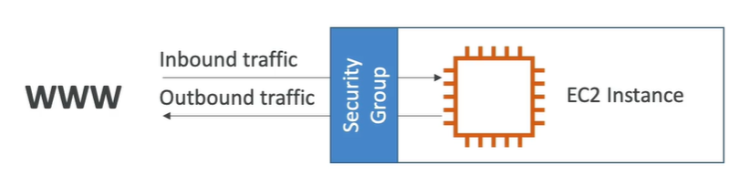
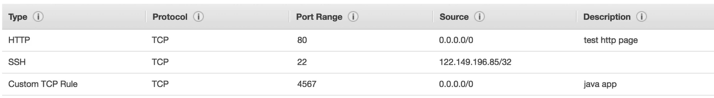

# EC2 Fundamentals

## Amazon EC2 
- EC2s is one of the most popular of aws offering
- EC2 = elastic compute cloud = infrastructure as a service
- it mainly consists in the capability of:
  - renting virtual machines (EC2)
  - storing data on virtual drives (EBS)
  - distributing load across machines (ELB)
  - scaling the services using an auto-scaling group (ASG).  

## EC2 sizing & configuration options
- operating system (OS), LINUX, Windows or Mac.
- how much compute power & cores (CPU)
- how much random-access memory (RAM)
- how much storage space:
  - network-attached (EBS & EFS)
  - hardware (EC2 instance store)
- network card: speed of the card, public IP address.
- firewall rules: security group
- bootstrap script (configure at first launch): EC2 use data.

## EC2 User Data
- it is possible to bootstrap out instances using an EC2 User Data script.
- bootstraping means lauching commands when a machine starts
- that script is only run once at the instance first start.
- EC2 user data is used to automate boot tasks such as:
  - installing updates
  - installing software
  - downloading common files from the internet.

## EC2 Instance Types Basics.

## EC2 Instance Types - Overview
- you can use different types of ec2 instances that are optimized for different use cases.
- AWS name convention:
  - **m5.2xlarge**
- m: instance class
- 5: generation
- 2xlarge: size within the instance class

## EC2 Instance Types - Genertal Purpose
- great for a diversity of workloads such as web servers or code repositories.
- balance between:
  - compute
  - memory
  - networking
- t2.micro is a general purpose EC2 instance.

##  EC2 Instance Types - Compute Optimized
- great for compute intensive tasks that require high performance processors.
  - batch processing worklods
  - media transcoding
  - high performance web servers
  - high performance computing (HPC)
  - scientific modeling & machine learning
  - dedicated gaming servers.

 ## EC2 Instance Types - Memory Optimized
 - fast performance for workloads that process large data sets in memory
 - use cases:
  -  high performance, relation, no relational databases
  - distributed web scale cache stores
  - in-memory databases optimized for BI (business intelligence)
  - applications performing real-time processing of big unstructured data

##  EC2 Instance Types - Storage Optimized
- great for storage-intensive tasks that require high, sequential read and write access to large dara sets on local storage.
- uses cases:
  - high frequency online transaction processing (OLTP) systems.
  - relational & NoSQL databases
  - cache for in-memory databases (redis)
  - data warehouse applications
  - distributed filesystems

# Introduction to Security Groups
- are the fundamental of network security in aws.
- they control how trafficis allowed into or out of our EC2 instances.
- security groups only contain rules
- security groups rules can reference by IP or by security group.

## Deeper Dive
- security groups are acting as a firewall on EC2 instances.
- they regulate:
  - access to ports
  - authorised IP ranges - IPv$ and IPv6
  - control of inbound network (from other to the instances)
  - control of outbound network (from the instance to other)

## Good to know
- can be attached to multiple instances
- locked down to a region/VPC combination
- does live outside of EC2
- it's good to maintain a one separate security group for SSH access.
- if your application it not accessible (time out), then a security group issue.
- all inbound traffic in blocked by default.
- all outbound traffic is authorised by default.

## Classic ports to know
- 22 = SSH (secure shell)
- 21 = FTP (file transfer protocol)
- 22 = SFTP (secure file transfer protocol)
- 80 = HTTP (access unsecured websites)
- 443 = HTTPS (access secured websites)
- 3389 = RDP (remote desktop protocol).

## EC2 Instances Purchasing Options
- on-demand instances - short workload, pricing, pay by second.
- reserved (1 & 3 years)
  - long workloads
  - convertible reserved instances - long workloads
- saving plans - (1 & 3 years) - commin

